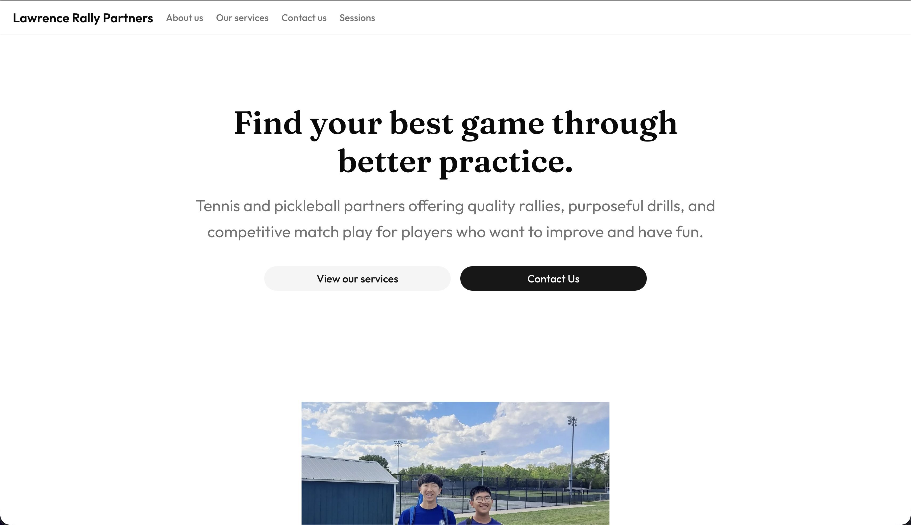

# 🔗 [Lawrence Rally Partners](https://lawrencerallypartners.vercel.app)

## Overview

Lawrence Rally Partners is a website for our tennis and pickleball practice partner business.

## What It Does

Some of the main features are:

- Introducing potential customers to the business
- Allows customers to book a session with us for more details
- Form is fully functional, with all sessions listed below the form and email sent to both admin and recipient after submission

## Screenshots / Photos



## About the project

We are passionate tennis and pickleball players that want to help other people in our community improve their games through consistent, reliable, and high-quality practice partners without spending a fortune on expensive training. This webpage is the official website for the business. Note that we will add many more improvements over time as the business grows and as we receive feedback from our customers, this is a pilot for demo purposes.

## Try it out!

Go to the [Lawrence Rally Partners](https://lawrencerallypartners.vercel.app) website, hosted on Vercel.

## How to Use

Go the [Lawrence Rally Partners website](https://lawrencerallypartners.vercel.app), explore the website and try to submit a session booking with the form at the bottom of the webpage. Then you can notice as the list below updates on submission and that you will receive a confirmation email confirming the details that you inputted.

If you would rather run this locally, I have instructions below.

## Tech Stack

- Next.js with React & Typescript
- Neon for DB and Drizzle as the ORM
- Mailjet for sending emails
- Tailwind CSS for styling and Shadcn UI for easy-to-edit and reusable components
- React Hook Form handles easy form input field management and Zod handles form validation and input validation
- PNPM as the package manager

## Components / Dependencies

To run this project you will need a few things setup:

- Node.js (At least version 20.9, check the Next.js docs for more information)
- PNPM (The package manager used in this project)
- Git (To clone the repo to your local machine)

## Setup Instructions

### 1. Install Node.js (Skip if you already have installed)

Go to the [Node.js website](https://nodejs.org/en) and follow the installation instructions there to install it on your machine. To verify it is working, you can enter the following command:

```bash
node --version
npm --version
```

If both commands run successfully and print out version numbers with no "not found" errors, then you are good to go.

### 2. Install PNPM

This project uses PNPM as the package manager. To install, run:

```bash
npm install -g pnpm@latest
```

Once installed, you can verify it is working by running the following command:

```bash
pnpm --version
```

If it prints a version number with no errors, then you are good to go. Otherwise, please refer to the [PNPM documentation](https://pnpm.io/installation) for more information.

### 3. Install Git (If not already installed)

Go to the [Git website](https://git-scm.com) and follow the installation instructions there to install it on your system (if you don't already have it).

Then run the following command to verify that it works:

```bash
git --version
```

If no errors are raised, then you are good to continue.

### 4. Clone the Repo!

To clone, run:

```bash
git clone https://github.com/Danieldkdao/lawrence-rally-partners.git
cd lawrence-rally-partners
pnpm install
```

Once finished, open the project in your favorite IDE or code editor.

## Configuration

Because the project uses @t3-oss/env-nextjs for environment variables, it will throw an error if you try to run the application without any of the following variables in an .env file at the root of the application:

```text
// .env
# Neon
DATABASE_URL=

# App
APP_URL=

# Mailjet
MAILJET_API_KEY=
MAILJET_API_SECRET=
SENDER_EMAIL=
ADMIN_EMAIL=
```

## Running the Project

To start the project locally, simply run:

```bash
pnpm db:push
pnpm dev
```

To confirm that the project is running successfully, you can go to [localhost:3000](http://localhost:3000) in your browser. If you see the landing page, then it worked!

To build the project for production, you can run:

```bash
pnpm build
```

See the package.json for more information.

## Troubleshooting

If you found a bug, an issue, or just have a feature request please don't hesitate to email me at [lawrencerallypartners@gmail.com](mailto:lawrencerallypartners@gmail.com). I am actively working on this and I hope to make this a real thing used by real people, so I would appreciate any feedback or requests you may have!

## Credits

The project was solely my creation with some AI assistance. No outside reference regarding the initial idea or code was used.

### AI Usage

AI was used for some tasks which I have documented below. Every line of AI generated code was read, understood, and tweaked if necessary.

- Helped me brainstorm ideas
- Automate some slow, boring, and manual tasks
- Guided me on some styling decisions

No other collaborators worked on this project other than myself.

## License

This project is licensed under the MIT license.
